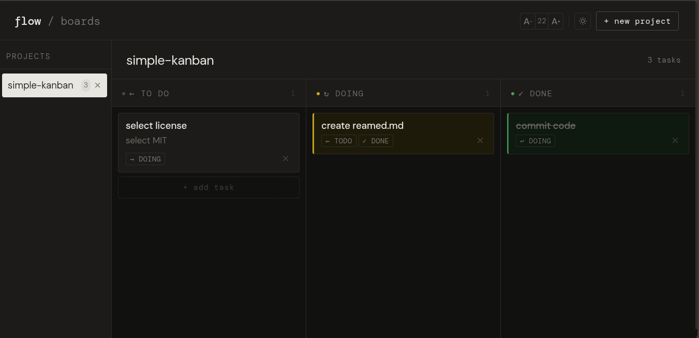
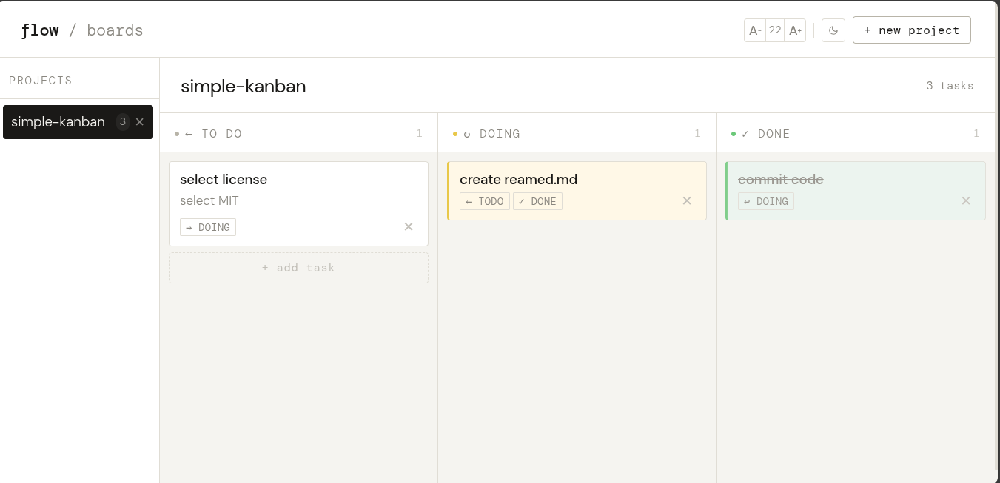

# Simple Kanban 📑

A minimalist Kanban website. 

[Link 🌐: https://pilotleoyan.github.io/simple-kanban/](https://pilotleoyan.github.io/simple-kanban/)

**features:**

1. 📁 Create different projects, each with its own tasks.
2. 📝 Create tasks, each with a title a description.
3. 🚦 Move tasks between **ToDO, Doing, and Done**.
4. 💻️ All information is stored locally.
5. ☀️ Switch between **Dark** and **Light** themes.
6. 🔓️ Open-source, edit that you want.

Give me a star ⭐️ please :D

## showcase

  
Dark theme.

  
Light theme.

## download code

1. [🗒️ Download the code here](https://github.com/PilotLeoYan/simple-kanban/archive/refs/heads/main.zip)
2. Extract the files from the .zip file.
3. Feel free to delete any unnecessary files, such as the *README.md* and *showcase/* folder. Do not delete **index.html** or **src/** folder.
